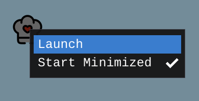
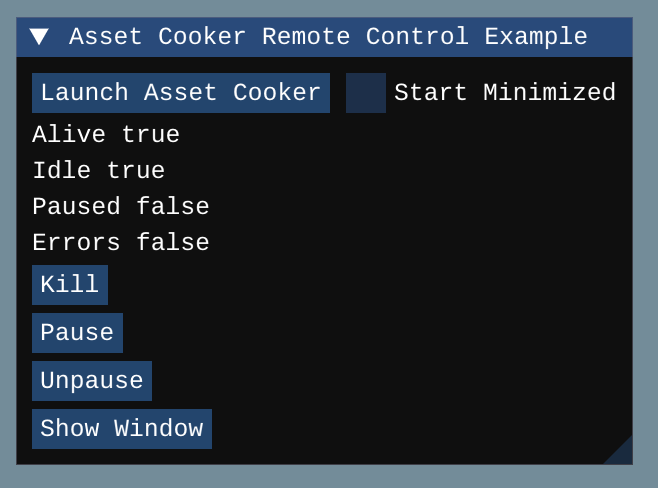

# Remote Control

This example shows how to control Asset Cooker from another process.

The idea is that your game can easily launch Asset Cooker when it starts, wait for it to finish cooking, and even open its window.

## Steps

1. Build the Release version of AssetCooker
2. Build this project (same build instructions as AssetCooker)
3. Run!

The small Asset Cooker icon is an interactive widget. It has a right click menu:

It also animates when Asset Cooker is busy:

The other imgui window is a very basic example of what the Asset Cooker API allows:

